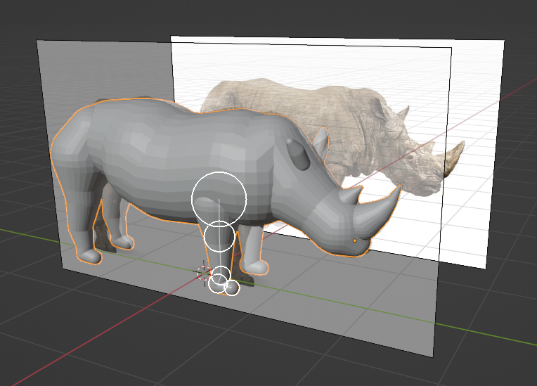

# Fast Sketch Blender Addon

This is a blender addon that helps you sketch out rough models for sculpting with balls and round tubes, similar to
Zpheres in ZBrush and [Dust3D](https://github.com/huxingyi/dust3d). It can also be used as a shortcut for skin modifier.

## Download

[v1.1.0](https://github.com/x6ud/fast-sketch-blender-addon/releases/download/v1.1.0/fast_sketch_1_1_0.zip) (for Blender
3.5)

## Usage

1. Select the Fast Sketch tool.
2. Hold Alt, then left-click to create a ball.
3. Hold Alt and left-click again, this creates another ball and links them into a round tube.
4. You can move the circles by dragging them, resize the circles by selecting them and scrolling the mouse wheel.
5. Press N and switch to the Fast Sketch side panel, you can create a new tube by clicking the + button.
6. In the side panel, switch x/y/z to enable symmetry.
7. Click the Bake! button to change the object into a normal mesh. Now it's ready for sculpting.

| Button                   | Acton                                 |
|--------------------------|---------------------------------------|
| Alt + Mouse Left         | Insert a node after the selected node |
| Alt + Shift + Mouse Left | Create a new branch                   |
| Mouse Wheel              | Resize selected nodes                 |
| Esc                      | Unselect nodes                        |